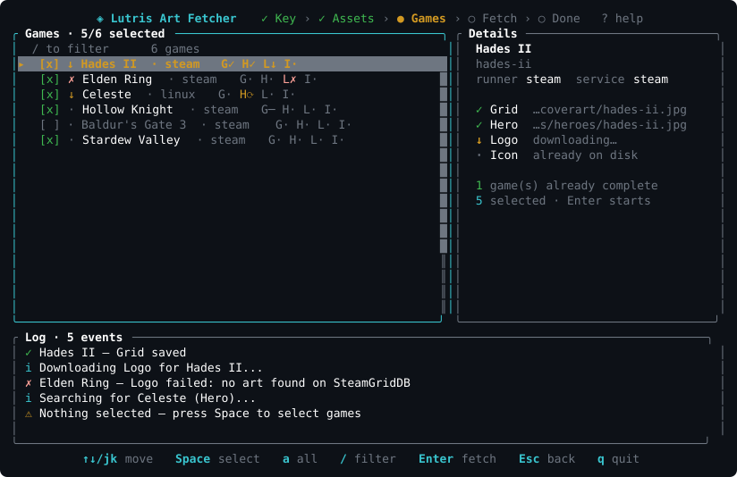

# Lutris Art Fetcher


A fast, interactive TUI that downloads cover art (grids, heroes, logos, and icons) for your installed [Lutris](https://lutris.net/) games — fetched from [SteamGridDB](https://www.steamgriddb.com/) with Steam Store fallback.



## Features

- **Full TUI** — interactive terminal interface built with [ratatui](https://ratatui.rs/)
- **Selectable games** — fetch art for your whole library or just a few games (`Space` to toggle, `a` for all, `/` to filter)
- **4 asset types** — grids, heroes, logos, and icons
- **Smart matching** — resolves games by Steam app ID first, falls back to name search
- **Steam + SteamGridDB sources** — SteamGridDB first, Steam Store assets when needed
- **Concurrent downloads** — configurable parallelism with semaphore-limited tasks
- **Atomic writes** — saves images via `.tmp` → `rename` to prevent corruption
- **Headless mode** — `--no-tui` for scripting and CI
- **Dry-run mode** — `--dry-run` to preview what would be downloaded
- **XDG config** — persists API key and preferences at `~/.config/lutrisartfetcher/config.toml`
- **Vim keybindings** — `j`/`k` navigation, `Space` to select, `/` to filter, `?` for help

## Requirements

- Rust 1.85+ (only to build from source; the prebuilt binary needs nothing)
- A [SteamGridDB API key](https://www.steamgriddb.com/profile/preferences/api) (free, still required)
- No Steam API key required for Steam Store fetching
- Lutris installed with at least one game

## Installation

### Prebuilt binary (recommended)

Grab the latest release for Linux x86_64 — no Rust toolchain needed:

```bash
curl -L -o lutrisartfetcher https://github.com/PerkyZZ999/LutrisArtFetcher/releases/download/v0.1.0/lutrisartfetcher-linux-x86_64
chmod +x lutrisartfetcher
./lutrisartfetcher
```

Move it somewhere on your `PATH` to run it from anywhere:

```bash
mkdir -p ~/.local/bin && mv lutrisartfetcher ~/.local/bin/
```

### From source

```bash
git clone https://github.com/PerkyZZ999/LutrisArtFetcher.git
cd LutrisArtFetcher
cargo build --release
```

The binary will be at `target/release/lutrisartfetcher` (≈6 MB with LTO + strip).

## Usage

### Interactive TUI (default)

```bash
lutrisartfetcher
```

1. Enter your SteamGridDB API key (saved for future runs)
2. Select which asset types to download
3. Review your game list — everything starts selected; `Space` toggles a game, `a` toggles all, `/` filters by name
4. Press `Enter` to download art for the selected games only
5. Watch real-time progress per game and asset

### Headless mode

```bash
lutrisartfetcher --no-tui
```

### Dry run

```bash
lutrisartfetcher --dry-run
```

### CLI options

```
Options:
      --no-tui                     Run without TUI (headless stdout output)
      --force                      Re-download existing covers
      --dry-run                    Show what would be downloaded
      --assets <ASSETS>            Asset types (comma-separated: grids,heroes,logos,icons)
                                   [default: grids,heroes,logos,icons]
      --concurrency <CONCURRENCY>  Max parallel downloads [default: 3]
  -h, --help                       Print help
  -V, --version                    Print version
```

## Configuration

Config is stored at `~/.config/lutrisartfetcher/config.toml`:

```toml
api_key = "your-steamgriddb-api-key"
preferred_grid_dimension = "600x900"
max_concurrent_downloads = 3
nsfw_filter = true
humor_filter = false
request_delay_ms = 200
```

## File layout

Assets are saved to Lutris's standard directories:

| Asset | Path |
|-------|------|
| Grid  | `~/.local/share/lutris/coverart/{slug}.jpg` |
| Hero  | `~/.local/share/lutris/heroes/{slug}.jpg` |
| Logo  | `~/.local/share/lutris/logos/{slug}.jpg` |
| Icon  | `~/.local/share/icons/hicolor/128x128/apps/lutris_{slug}.png` |

Restart Lutris after downloading to see the new art.

## Keybindings

| Key | Action |
|-----|--------|
| `j` / `↓` | Move down |
| `k` / `↑` | Move up |
| `PgDn` / `PgUp` | Page down / up |
| `Home` / `End` | Jump to first / last |
| `Space` | Toggle selection (assets & games) |
| `a` | Toggle all (assets & shown games) |
| `/` | Filter game list by name |
| `C` | Clear game filter |
| `Enter` | Confirm / start downloads for selected games |
| `Esc` | Back to assets / clear filter |
| `q` | Quit (clears filter first) |
| `?` | Toggle help |
| `Ctrl+C` | Force quit |

## Development

This project uses the `rust-tc` quality gates (see `AGENTS.md`):

```bash
rust-tc quick    # fmt + check + clippy + tests — after meaningful edits
rust-tc doctor   # full gate (deps, features) — before finishing work
```

The README screenshot (`assets/tui.svg`) is generated from the real UI by a test — it refreshes on every `cargo test` run, so it never goes stale.

## Project structure

```
src/
├── main.rs          # CLI parsing, mode dispatch
├── config.rs        # TOML config + XDG paths
├── db.rs            # Lutris SQLite reader
├── api/
│   ├── mod.rs       # Module re-exports
│   ├── models.rs    # API response types + enums
│   ├── client.rs    # SteamGridDB HTTP client
│   └── steam_store.rs # Steam Store fallback client
├── download.rs      # Download orchestration + atomic writes
├── tui.rs           # Terminal lifecycle (raw mode, alternate screen)
├── event.rs         # Async event system (keys, ticks, progress)
├── app.rs           # State machine + key handling
├── ui.rs            # ratatui rendering (all screens)
└── screenshot.rs    # Test-only README screenshot generator
```

## License

MIT
